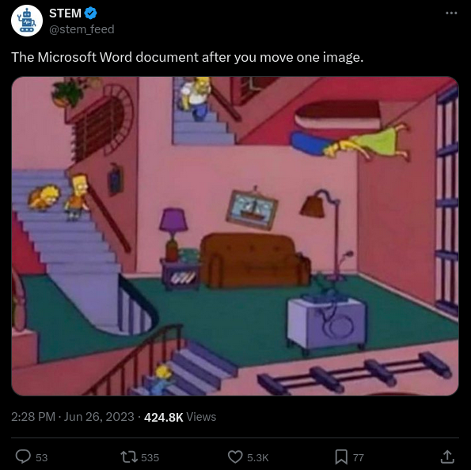
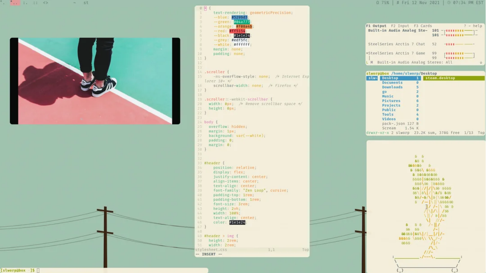

## Cómo el mercado arrunió el placer visual

Hablaba estos días con un amigo sobre una de las últimas actualizaciones que había recibido en su móvil y cómo había arruinado la estética de su pantalla. Si tienes el móvil muy personalizado y te gusta lo que has conseguido, cuando algo te lo desorganiza tiende a ser bastante molesto. El problema se agrava cuando estos cambios que han introducido ni si quiera son reversibles, y te toca amoldarte a una nueva realidad (aunque sea digital) para la que no estabas preparado.

Tras varios mensajes llegamos a la conclusión de que la problemática radicaba en que, en la industria, hoy en día, los que toman las decisiones tiene varios problemas en lo que se refiere a la estética. Por un lado, lo de la estética como tal les importa más bien poco, lo que quieren es sacar el producto lo antes posible y seguir alimentando sus departamentos con recursos, no sea que se los quiten. Por otro lado, no quieren saber nada de funcionalidades ni experiencias placenteras que nos hagan perder el tiempo, pues el resultado es lo importante. Y por un tercer lado, no quieren saber nada al respecto de la estética, y están orgullosos de ello. La toma de decisiones viene protagonizada siempre por el máximo beneficio, una vez más, y el menor tiempo de producción posible, al menor coste, íntimamente relacionados.

{marginnote}Sigo pensando que el menor coste de producción o la rapidez no tienen por qué ir ligados con lo cutre. No así, en el mercado, siempre que se intenta llegar a las masas o se intenta sacar rápido, va intrísecamente en el adn de la solución.{/marginnote}

Hubo un tiempo en el que las cosas no eran del todo funcionales, pero tenían su estética y lo hacían bien. Hay algunos programas que la han mantenido, siendo igual de funcionales o más que los productos comerciales, y dándole un lugar a todos aquellos usuarios avanzados que quieren mantener sus funcionalidades y experiencia. Podemos hablar de las herramientas [gnu](https://www.gnu.org/software/software.html), de las herramientas [suckless](https://www.suckless.org). Que tengan ese nombre no es casual, y, de hecho, esta conversación forma parte de su manifiesto ["... quality software with a focus on simplicity, clarity and frugality."](https://suckless.org/philosophy/). Pero no nos dejemos engañar. Que lo sencillo, claro y sobrio no es sinónimo de poco útil. La gente de suckless ha sido capaz de torsionar el software hasta grados inesperados, donde uno tiene la posibilidad de desarrollar su individualidad y personalidad y plasmarla en forma de estética de escritorio.

##### Pasamos de una pantalla no muy clara y sin vida.

##### A pantallas que representan el gusto de una persona, su individualidad y su manera de ver el mundo.

La [enshittification](https://en.wikipedia.org/wiki/Enshittification) es un fenómeno bastante peligroso. Puedes estar tranquilo usando tu plataforma favorita, o tu aplicación favorita, que de repente, un día pasa a estar en otras manos y, antes de que te des cuenta, empieza a padecer entropía. La decadencia de las plataformas descrita en la **enshittification** es algo que ocurre porque el sistema no puede mantener las cosas como están de manera estática y seguir generando beneficios de manera constante. En cierto sentido, hay que empeorar los servicios para mejorarlos, o para que aparezcan nuevos protagonistas. Es lo mismo que ocurre con el mercado de los bienes de consumo y la obsolescencia programada. Si querías ropa que fuese de calidad y duradera, has nacido en el periodo equivocado. Lo económicamente sostenible es vestir plástico, padecer enfermedades en la piel y que la ropa te dure 2 telediarios.

Algunas compañías y herramientas intentan apartarse de este fenómeno, aunque con cierta cautela. Compañías como Apple, que tienen [cierta obsesión por la curva de euler](https://es.wikipedia.org/wiki/Clotoide) y todavía mantienen estándares de calidad muy altos en cuanto a diseño y a estética, tanto en sus productos físicos como digitales, encuentran ciertos recovecos para poder sostener que sus teléfonos se deterioren con el tiempo a través de actualizaciones forzadas y pese a que computacionalmente no sería necesario cambiarlos, te "obliguen" en cierta forma a sustituirlos por unos más nuevos. También podemos encontrar herramientas como [novlr](https://www.novlr.org/), para escritores. En este caso tanto la web como el programa *per se* son bastante placenteros en cuanto a estética y funcionalidad. Este tipo de empresas o herramientas son pocas, dado que no siempre es sostenible mantenerlas ni invertir si no sacas suficiente dinero como para distinguirte, y menos si eres opensource.

Y también hay herramientas que quieren seguir siendo útiles pero con estética minimalista. Ahí está [calcurse](https://calcurse.org/) que hacen un calendario en terminal, sencillo, con unas cuantas funcionalidades y que hace bien lo que tiene que hacer. Es decir. No todo está perdido. La estética se sigue anteponiendo, ya sea como manera de demostrar tu personalidad e indivudalidad, y a base de aprender y ver en otros sitios lo que quieres y compartir y contraponer tus gustos con lo que te ofrece el violento mercado, puedes llegar a obtener cosas muy placenteras.

{marginnote}El juicio de gusto no funda el placer en ningún concepto, ni en ninguna finalidad determinada, sino en la libre armonía de la imaginación y el entendimiento, que sentimos como libertad en el juego de nuestras facultades cognitivas. (*Crítica del juicio*, §9){/marginnote}

En conclusión. Que no siempre se toman las mejores decisiones por las mejores personas y más preparadas, en esta era de la mediocridad. Que el mercado siempre intenta llegar a todos y para hacerlo ha de estar en continuo cambio, pese a que no sea siempre en la mejora de la experiencia o en obtener una mejor estética. Pero que si rebuscas, si vas al fondo, todavía hay gente que puede mantener unos estándares que sobrepasan cualquier cosa industrializada. La artesanía digital tiene su espacio y siempre lo va a tener, pese a que cada vez nos cueste más encontrarla en un mundo tan industrializado. La belleza es sinónimo de lo que es el ser humano y su libertad.

